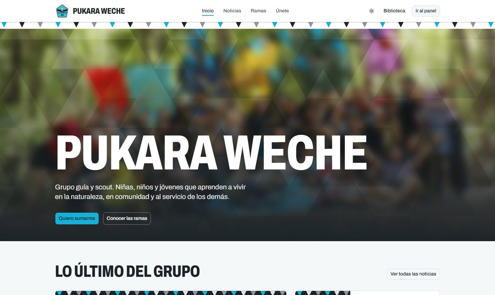
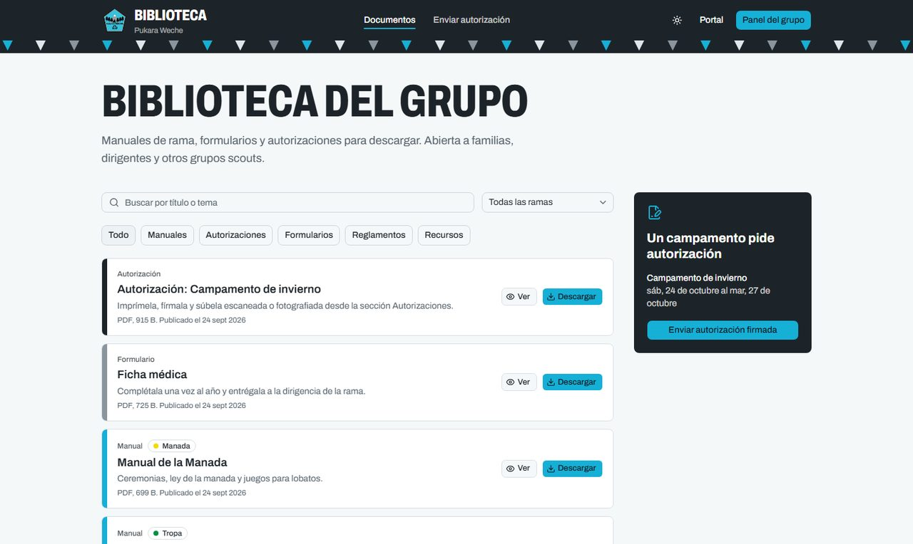
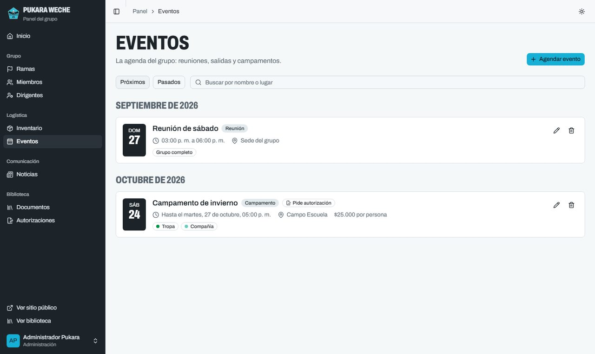
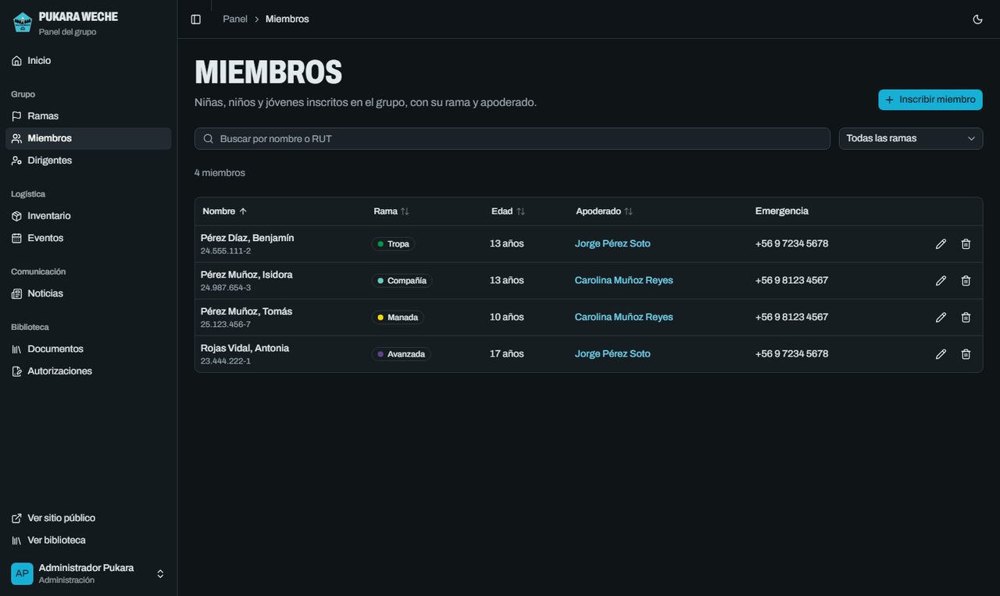

# ⚜️ PukaraWeb


**La plataforma digital del Grupo Guía y Scout Pukara Weche**: un portal de noticias para las familias, una biblioteca abierta de documentos y un panel para que los dirigentes administren el grupo, conectados en un solo lugar.



---

## ⛺ Sobre el proyecto

Este proyecto nace desde el corazón y la gratitud hacia mi querido **Grupo Scout Pukara Weche**. La misión es simple pero poderosa: poner la tecnología al servicio del escultismo.

Mi intención es facilitar las tareas administrativas y logísticas que, aunque necesarias, muchas veces consumen el tiempo valioso de nuestros dirigentes. Al digitalizar y organizar la gestión del grupo, buscamos que el equipo pueda enfocar sus energías en lo que realmente importa: educar, jugar, compartir y construir un mundo mejor junto a los niños y jóvenes. Es mi forma de "Servir" y dejar nuestro grupo un poco mejor de lo que lo encontramos.

---

## 🧭 Tres servicios, una plataforma

| | Para quién | Qué ofrece |
|---|---|---|
| **📰 Portal** | Familias, interesados y otros grupos | Noticias y avisos del grupo, las seis ramas con sus edades y cómo sumarse |
| **📚 Biblioteca** | Todos, sin necesidad de cuenta | Manuales de rama, formularios y reglamentos para descargar, y el envío de autorizaciones firmadas para campamentos |
| **🏕️ Panel del grupo** | Dirigentes y administración | Miembros, ramas, dirigentes, inventario, eventos, noticias, documentos y autorizaciones |

Los tres están conectados: lo que se publica en el panel aparece en el portal y en la biblioteca, y las autorizaciones que suben los apoderados llegan directo al panel, donde solo los dirigentes pueden verlas.

### 📰 Portal de noticias

- Noticias con portada, contenido enriquecido y publicaciones de redes sociales incrustadas.
- Presentación de las ramas (Manada, Bandada, Tropa, Compañía, Avanzada y Clan) con sus estandartes.
- Sección para las familias que quieren sumarse al grupo.
- La foto del grupo se muestra difuminada desde el propio archivo, para proteger la identidad de niñas, niños y jóvenes.

### 📚 Biblioteca



- Documentos filtrables por categoría (manuales, formularios, reglamentos, recursos) y por rama.
- **Autorizaciones para campamentos**, en tres pasos:
  1. El apoderado elige el campamento y descarga el formulario.
  2. Lo firma a mano.
  3. Lo sube escaneado o fotografiado junto al RUT de su hija o hijo.
- El sistema verifica que el RUT corresponda a un integrante inscrito en ese campamento y revisa que el archivo sea realmente un PDF o una imagen.

### 🏕️ Panel del grupo



- **Miembros**: fichas con rama, edad y apoderado; búsqueda, filtros y orden por columna.
- **Ramas**: cada unidad con su equipo de dirigentes y cantidad de integrantes.
- **Dirigentes**: estado de la documentación obligatoria (antecedentes, inhabilidades, currículum…) y los archivos guardados en la ficha de cada uno.
- **Inventario**: materiales, estado, cantidad y dónde se guardan, con aviso de lo que necesita reparación.
- **Eventos**: agenda por mes, ramas participantes, costo y si se pide autorización a los apoderados.
- **Noticias y documentos**: publicación y edición con vista previa de cómo se verá en el portal.
- **Autorizaciones**: quién ya envió la autorización firmada de cada campamento, quién falta, y aprobación o rechazo con el motivo.

### 🌗 Modo oscuro

Los tres servicios tienen modo claro, oscuro o según el dispositivo.



---

## 🛠️ Tecnologías

| Capa | Tecnologías |
|---|---|
| **Frontend** | React 19, Vite 7, React Router 7, Tailwind CSS 4, shadcn/ui (Radix), lucide-react |
| **Backend** | Java 17, Spring Boot 3.5, Spring Data JPA, Spring Security con JWT |
| **Base de datos** | MySQL 8 en producción; H2 embebida para desarrollo y pruebas (no requiere instalación) |

---

## 🚀 Cómo ejecutarlo

### Requisitos

- **JDK 17 o superior**
- **Node.js 20.19 o superior**
- MySQL 8 solo si quieres usar la configuración de producción; para desarrollar no hace falta.

### 1. Backend

```bash
cd backend
./mvnw spring-boot:run -Dspring-boot.run.profiles=dev
```

El perfil `dev` usa una base H2 guardada en `backend/data/` y carga datos de prueba la primera vez: ramas, miembros, dirigentes, inventario, eventos, noticias y documentos de la biblioteca.

- API: http://localhost:8080
- Consola de la base de datos: http://localhost:8080/h2-console (JDBC `jdbc:h2:file:./data/pukaraweb-dev`, usuario `sa`, sin contraseña)

### 2. Frontend

```bash
cd frontend
npm install
npm run dev
```

Abre http://localhost:5173. Para entrar al panel usa `admin` / `admin123`.

> ⚠️ Esas credenciales son solo para desarrollo local. Antes de publicar la plataforma hay que cambiarlas (ver el roadmap).

### Pruebas

```bash
cd backend
./mvnw test          # usa H2 en memoria, no necesita MySQL
```

---

## 📁 Estructura

```
PukaraWeb/
├── backend/                     API REST en Spring Boot
│   └── src/main/java/com/pukaraweb/PukaraWeb/
│       ├── biblioteca/          documentos públicos y autorizaciones firmadas
│       ├── equipo/              documentación de dirigentes
│       ├── comun/               almacenamiento de archivos y errores de la API
│       ├── controller/ service/ repository/ model/   módulos originales del grupo
│       ├── security/            autenticación con JWT
│       └── config/              datos iniciales y de prueba
├── frontend/                    aplicación React
│   └── src/
│       ├── layouts/             portal, biblioteca y panel
│       ├── pages/               pantallas de cada servicio
│       ├── components/          componentes de marca, del panel y de shadcn/ui
│       └── lib/                 acceso a la API y utilidades
└── docs/capturas/               imágenes de este README
```

---

## 🗺️ Roadmap

- [x] Portal de noticias público
- [x] Panel del grupo con miembros, ramas, dirigentes, inventario, eventos y noticias
- [x] Biblioteca de documentos y autorizaciones firmadas para campamentos
- [x] Documentación de dirigentes guardada en su ficha
- [x] Rediseño con identidad propia, modo oscuro y diseño adaptable a celular
- [ ] Seguridad antes de publicar: roles de usuario, credenciales fuera del código y protección de datos personales
- [ ] Imágenes de noticias en almacenamiento de archivos
- [ ] Pagos de cuotas y campamentos
- [ ] Despliegue en producción

---

"El verdadero camino para conseguir la felicidad pasa por hacer felices a los demás. Intenta dejar este mundo un poco mejor de como lo encontraste." — Baden-Powell

Desarrollado con ❤️ para Pukara Weche, 2025–2026.
